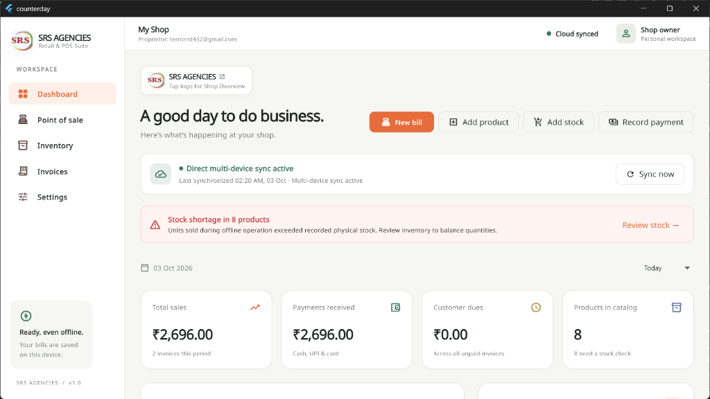
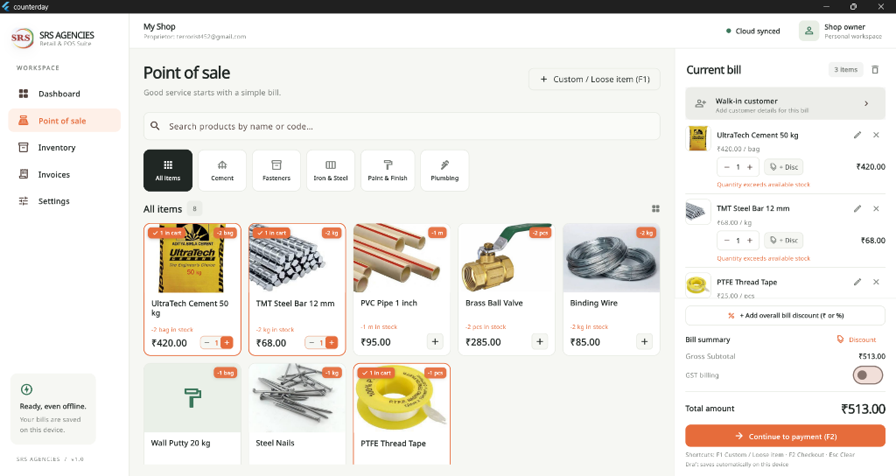
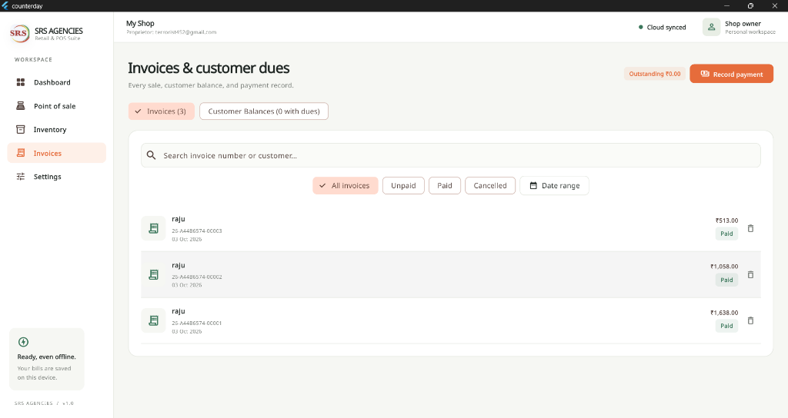
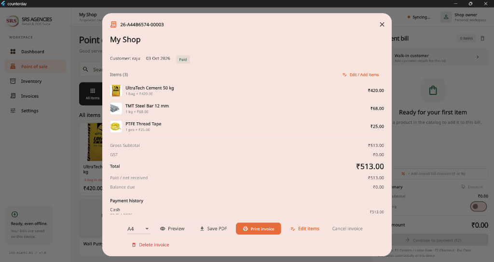

# SRS AGENCIES • Retail & Hardware POS Billing Software


A high-speed, modern, **offline-first Point of Sale (POS) and inventory management application** tailored specifically for hardware stores, building materials suppliers (Cement, Iron & Steel, Plumbing, Paints, Electricals), and retail shops.

Engineered to operate seamlessly without an active internet connection, while providing optional multi-device cloud synchronization via Supabase for shop owners managing billing across tablets, mobile phones, and Windows desktop counters.

---

## 🚀 Key Highlights

- **100% Offline-Ready**: Every bill, payment, customer ledger entry, and inventory movement is saved immediately to local storage on the device.
- **High-Speed Checkout**: Keyboard shortcuts (`F1` for custom/loose items, `F2` for instant checkout, `Esc` to clear), instant product search, and barcode scanner integration.
- **Loose Item & Fractional Billing**: Native support for loose items sold by weight (`kg`, `g`, `ton`), length (`m`, `ft`), or volume (`ltr`), accurate to 3 decimal places (e.g. `2.500 kg nails`, `12.500 m wire`).
- **Flexible Dual Discounts**: Apply line-item discounts directly on individual product rows, and apply overall bill discounts strictly at the gross payment level.
- **Customer Ledgers & Dues**: Complete customer balance tracking, credit sales, payment collections, and outstanding dues management.
- **Smart Category & Unit Normalization**: Dual-selector dropdowns with custom input options and case-insensitive matching (e.g., auto-merging `cement` and `Cement`).
- **Multi-Format Receipt & Invoice PDF Engine**:
  - **Thermal Roll (58mm & 80mm)** for fast receipt printers.
  - **Standard A4 & A5** format for full-page tax/commercial bills.
- **Dedicated SRS Branding**:
  - Custom launcher icons across all Android display densities (`mdpi` through `xxxhdpi`).
  - Native launch screen & animated in-app splash screen.
  - Interactive Company Overview / Landing page accessible via logo tap.

---

## 📸 Application Screenshots & UI Showcase

Explore the clean, modern, and industrial user interface of the application:

### 1. Real-Time Business Dashboard

- **Financial Performance Pulse**: At-a-glance KPI cards tracking **Total Sales**, **Payments Received**, **Customer Credit Dues**, and **Catalog Products**.
- **Real-Time Cloud Synchronization**: Dynamic status pill showing active direct multi-device sync with timestamp and a 1-tap manual sync button.
- **Stock Shortage Intelligence**: Proactive alert system warning store owners when sales exceed physical recorded stock with a direct review link.
- **Quick Action Bar**: Fast 1-click triggers to start a **New Bill**, **Add Product**, **Add Stock**, or **Record Payment**.
- **Offline Reliability Badge**: Displays persistent offline readiness indicating all records are safely saved locally on device SQLite.

### 2. Point of Sale (POS) Checkout Counter

- **Visual Product Grid**: Interactive hardware catalog cards displaying item photos, current stock indicators, pricing, and rapid increment/decrement controls.
- **Category Filter Chips**: 1-tap instant category filtering (*Cement*, *Fasteners*, *Iron & Steel*, *Paint & Finish*, *Plumbing*).
- **Persistent Cart Drawer**: Real-time invoice staging displaying selected items, unit prices, quantity multipliers, and line-item discount controls (`+ Disc`).
- **Rapid Keyboard Workflow**: Supports power-user shortcuts (`F1` for custom/loose items, `F2` for instant checkout, `Esc` to clear).
- **Customer Assignment**: 1-click walk-in customer selection or customer account search for credit billing.

### 3. Invoices Register & Customer Ledger

- **Comprehensive Invoice History**: Filter invoices by *All*, *Unpaid*, *Paid*, *Cancelled*, or custom *Date range*.
- **Instant Search**: Search records in real-time by invoice number or customer name.
- **Status & Details**: Clear visibility of unique invoice IDs, generation timestamps, gross amounts, and payment status badges.
- **Customer Balances Toggle**: Fast one-click toggle to view customer accounts with outstanding balances and record collections.

### 4. Interactive Invoice Inspection & Printing Modal

- **Itemized Bill Breakdown**: Comprehensive breakdown of products, itemized rates, quantities, and gross totals.
- **Multi-Format Print Engine**: Instant format switcher supporting **Standard A4**, **A5**, and **58mm / 80mm Thermal Receipt Printers**.
- **Direct PDF Export & Sharing**: One-tap triggers to **Preview**, **Save PDF**, and **Print Invoice**.
- **Safe Invoice Deletion & Restoration**: Deleting an invoice automatically reverses inventory deductions, restoring physical stock back to the catalog.

---

## 📱 Modules & Features

### 1. Dashboard
- **Financial Pulse**: Real-time summary of today's sales, payments collected, unpaid customer balances, invoice count, and low-stock alerts.
- **Quick Action Bar**: 1-click access to **New Bill**, **Add Product**, **Add Stock**, and **Record Payment**.
- **Adaptive Layout**: Responsive portrait and landscape orientation support for phones, tablets, and wide PC monitors.
- **Clean Connectivity Status**: Reassuring offline-ready banner with cloud sync indicators.

### 2. Point of Sale (POS)
- **Product Catalog Search**: Real-time search by item name or product code, with category filter chips.
- **Custom / Loose Item Billing (`F1`)**: Instant entry modal for open items, custom charges, or unlisted goods with custom unit dropdowns.
- **Split Payments**: Collect payments across **Cash**, **UPI**, and **Customer Credit** within the same invoice.
- **Auto-Saved Drafts**: Persistent local draft recovery protects against accidental tab closure or power loss.

### 3. Inventory & Stock Management
- **Product Directory**: Comprehensive product table with real-time stock status pills, selling price, GST rates, and HSN codes.
- **Unit of Measurement Dropdown**: Pre-loaded with standard hardware units (`pcs`, `kg`, `bag`, `ton`, `m`, `ft`, `ltr`, `box`, `pkt`, `sq.ft`, etc.) with custom unit input and quick-touch chips.
- **Inward Stock Receiving Modal**: Fast purchase stock addition with quick quantity presets (`+10`, `+25`, `+50`, `+100`).
- **Immutable Movement Ledger**: Full audit trail of stock adjustments, customer sales, and invoice deletion reversals.

### 4. Invoices & Customer Ledger
- **Invoice Register**: Filter by status (*All*, *Paid*, *Partial*, *Unpaid*, *Cancelled*).
- **Invoice Deletion with Stock Restoration**: Safe invoice deletion that restores inventory stock back to catalog items and updates payment balances.
- **Customer Dues Tracking**: Directory of customers with positive outstanding balances, with 1-tap payment recording dialog.
- **Print & Share**: Built-in multi-platform PDF viewer, printer integration, and file sharing.

### 5. Settings & Cloud Sync
- **Shop Profile**: Business name, category, phone number, physical address, and GSTIN.
- **Printer Configuration**: Select thermal roll width (58mm / 80mm) or sheet sizes (A4 / A5).
- **Cloud Account**: Real-time Supabase integration with automatic background sync and 1-tap manual sync.

### 6. Authentication & Multi-Tenant Onboarding
- **Multi-Tenant Shop Isolation**: Physical data separation at both layers:
  - *Offline Layer*: Dynamic SQLite database files per shop (`counterday_${user.id}.sqlite`).
  - *Cloud Layer*: Scoped PostgreSQL queries with compound primary keys `(shop_id, kind, id)` and Row Level Security. Shop A can never view or overwrite Shop B's records.
- **Flexible Identifier (User ID or Email)**: Register and log in using either a standard email (`owner@store.com`) or a plain user ID/username (`raju`, `shop101`). Identifiers are automatically formatted and validated.
- **3-Step Instant Onboarding**: Fast onboarding wizard collecting credentials, business information, and tax details, directing immediately to the POS dashboard without email verification roadblocks.

---

## 🛠️ Tech Stack & Architecture

| Layer | Technology |
|---|---|
| **Framework** | [Flutter](https://flutter.dev/) (Channel stable, Material 3) |
| **Language** | [Dart](https://dart.dev/) |
| **State Management** | [Riverpod](https://riverpod.dev/) + `ChangeNotifier` |
| **Routing** | [GoRouter](https://pub.dev/packages/go_router) |
| **Local Storage** | Shared Preferences + Structured JSON & SQLite-compatible local storage |
| **PDF Generation** | [pdf](https://pub.dev/packages/pdf) & [printing](https://pub.dev/packages/printing) |
| **Cloud Sync** | [Supabase Flutter](https://pub.dev/packages/supabase_flutter) |
| **Date & Currency** | [intl](https://pub.dev/packages/intl) (Indian Rupee `₹` & `en_IN` formatting) |

---

## 🏁 Getting Started

### Prerequisites
- [Flutter SDK](https://docs.flutter.dev/get-started/install) (version 3.24+ recommended)
- Android Studio / Android SDK (for Android builds)
- Visual Studio with C++ tools (for Windows builds)
- Google Chrome (for Web testing)

### Installation

1. **Clone the repository**:
   ```bash
   git clone https://github.com/rajureddi/Billing-Software-pos-.git
   cd Billing-Software-pos-
   ```

2. **Install dependencies**:
   ```bash
   flutter pub get
   ```

3. **Verify the installation**:
   ```bash
   flutter analyze
   flutter test
   ```

---

## 💻 Running the Application

### Android (Phone / Tablet)
Connect an Android device with USB debugging enabled, or start an emulator:
```bash
flutter run -d android
```

To build a standalone production release APK:
```bash
flutter build apk --release
# Output APK: build/app/outputs/flutter-apk/app-release.apk
```

### Windows Desktop
```bash
flutter run -d windows
```

To build the standalone Windows executable:
```bash
flutter build windows --release
# Output folder: build/windows/x64/runner/Release/
```

### Web Browser
```bash
flutter run -d chrome
```

To build the static web deployment bundle:
```bash
flutter build web --release
# Output directory: build/web/
```

---

## 🌐 Deploying Web Version to Vercel

Yes! You can deploy the web version to **Vercel** with full Single Page Application (SPA) routing support.

### Option A: Instant CLI Deploy (Quickest & Simplest)
Once you have built the web release:
```bash
flutter build web --release
npx vercel deploy build/web --prod
```
- When prompted, log in with your Vercel account or GitHub.
- Your live production URL (e.g. `https://srs-agencies.vercel.app`) will be generated immediately!

### Option B: Automatic Deployment via Vercel Dashboard (Git Integration)
1. Go to your [Vercel Dashboard](https://vercel.com/new).
2. Click **Add New…** > **Project** and select your GitHub repository: `Billing-Software-pos-`.
3. In **Build and Output Settings**:
   - **Framework Preset**: Select `Other`.
   - **Build Command**: `bash vercel-build.sh` (pre-configured script that installs Flutter & compiles the web app).
   - **Output Directory**: `build/web`.
4. Click **Deploy**. Vercel will automatically build and publish your web POS app!

### Option C: Continuous Deployment via GitHub Actions
A pre-configured GitHub Actions workflow [`.github/workflows/deploy.yml`](file:///.github/workflows/deploy.yml) is included. Every push to `main` automatically runs unit tests, compiles Flutter Web, and publishes to Vercel.

---

## 🧪 Testing & Verification

The project includes an automated test suite covering billing calculations, GST logic, discounts, storage reversals, and PDF generation:

```bash
flutter test
```

### Test Coverage Highlights:
- Fractional quantity pricing & loose item discount calculations.
- Tax-inclusive vs. tax-exclusive GST extraction.
- Single-item discount isolated from overall gross payment discount.
- Proportional paise allocation on mixed GST rates.
- Multi-line A4, A5, 58mm, and 80mm PDF receipt rendering.
- Offline stock movements and invoice deletion reversals.
- Case-insensitive category normalization.

---

## 🎨 White-Labeling & Customization Guide

If you want to rebrand or customize this POS application for a different business, client, or store, follow the guide below:

### 1. App Logo & Brand Identity

| Asset / File | File Path | Description |
|---|---|---|
| **Logo Image File** | [`assets/images/srs_logo.jpg`](file:///assets/images/srs_logo.jpg) | Main logo image used across the splash screen, navigation header, and landing page. Replace this file with your logo (PNG, JPG, or WebP). |
| **Brand Widget & Tokens** | [`lib/ui/branding.dart`](file:///lib/ui/branding.dart) | Contains `srsLogoWidget()` which controls the logo's dimensions, border radii, shadows, and fallback typography if the image fails to load. |
| **Brand Titles & Subtitles** | [`lib/ui/branding.dart`](file:///lib/ui/branding.dart#L4-L6) | Edit `appTitle`, `appTagline`, and `appSubtitle` to change the global brand strings displayed in headers and PDFs. |

> **Tip**: If you use a different image name or extension (e.g. `assets/images/my_logo.png`), make sure it is registered in [`pubspec.yaml`](file:///pubspec.yaml) under `flutter: assets:` and updated on line 35 of [`lib/ui/branding.dart`](file:///lib/ui/branding.dart).

---

### 2. Splash / Loading Screen Customization

The animated loading screen is completely modular and can be customized in [`lib/ui/splash_screen.dart`](file:///lib/ui/splash_screen.dart):

- **Display Duration**:
  In `initState()` (around line 50), adjust the timer duration:
  ```dart
  _timer = Timer(const Duration(milliseconds: 2500), () { ... });
  ```
- **Animations & Easing**:
  Modify `_fadeAnimation`, `_blurAnimation`, or `_slideAnimation` in [`splash_screen.dart`](file:///lib/ui/splash_screen.dart#L28-L48) to tweak animation curves, blur radius, or slide offsets.
- **Brand Title & Tagline on Splash**:
  Around line 139, customize the text widgets:
  ```dart
  const Text('YOUR SHOP NAME', style: TextStyle(...)),
  const Text('RETAIL & WHOLESALE BILLING', style: TextStyle(...)),
  ```
- **Background & Backdrop Filter**:
  Around line 68, modify the background `Scaffold` color, subtle gradient circles, or glassmorphic blur card container.

---

### 3. Native Platform Launcher Icons & Favicons

To update the launcher icon shown on device home screens and title bars:

- **Android Launcher Icons**: Replace the icon images in:
  - `android/app/src/main/res/mipmap-mdpi/ic_launcher.png` (48x48)
  - `android/app/src/main/res/mipmap-hdpi/ic_launcher.png` (72x72)
  - `android/app/src/main/res/mipmap-xhdpi/ic_launcher.png` (96x96)
  - `android/app/src/main/res/mipmap-xxhdpi/ic_launcher.png` (144x144)
  - `android/app/src/main/res/mipmap-xxxhdpi/ic_launcher.png` (192x192)
- **Android Native Splash Screen**:
  - `android/app/src/main/res/drawable/launch_background.xml`
  - `android/app/src/main/res/drawable-v21/launch_background.xml`
- **Windows Desktop Executable Icon**:
  - Replace `windows/runner/resources/app_icon.ico` with your Windows icon file.
- **Web Browser Favicon & PWA Icons**:
  - Replace `web/favicon.png` with your 32x32 favicon.
  - Replace `web/icons/Icon-192.png` and `web/icons/Icon-512.png` for PWA home screen pinning.

---

### 4. Default Store Configuration & Settings

To change the default shop profile, tax preferences, and receipt footer for fresh installations:

Open [`lib/data/app_store.dart`](file:///lib/data/app_store.dart#L134) and customize the `defaultSettings` map:
```dart
static Map<String, dynamic> get defaultSettings => {
  'name': 'My Store',                                         // Store name
  'tagline': 'Retail & Billing',                             // Subtitle
  'category': 'General Retail',                              // Business category
  'address': '123 Market Street, City',                      // Store address
  'phone': '+91 98765 43210',                                // Phone number
  'footer': '1. Goods once sold cannot be returned. ...',   // Receipt terms
  'paper': 'A4',                                             // Default print format ('A4', 'A5', '58mm', '80mm')
  'gstEnabled': false,                                       // Enable GST calculation by default
};
```

---

## 📁 Directory Structure

```text
billing_software/
├── android/               # Android native configuration, splash & launcher icons
├── assets/images/         # Branding assets (srs_logo.jpg, app logos)
├── lib/
│   ├── data/              # Storage engines, multi-tenant SQLite & AppStore
│   │   ├── app_config.dart    # Environment config, auth email normalizer
│   │   └── app_store.dart     # Scoped SQLite database, billing actions, defaults
│   ├── domain/            # Billing math, GST calculations, discount logic
│   ├── services/          # Cloud sync (Supabase), PDF invoice generator
│   ├── ui/                # User interface screens & widgets
│   │   ├── app.dart           # App shell, theme, navigation & top bar
│   │   ├── branding.dart      # Logo widget, color tokens, branding strings
│   │   ├── common.dart        # Reusable UI widgets & UnitSelector
│   │   ├── dashboard.dart     # Sales metrics, quick actions & alerts
│   │   ├── inventory.dart     # Product catalog, stock receiving modal
│   │   ├── invoices.dart      # Invoices history, customer balances ledger
│   │   ├── landing_page.dart  # Company overview & module portal
│   │   ├── login_page.dart    # Secure login with User ID or Email
│   │   ├── onboarding_page.dart # 3-Step shop setup & multi-tenant onboarding
│   │   ├── pos.dart           # Point of sale checkout & custom item modal
│   │   ├── settings.dart      # Shop profile, printer settings, cloud sync
│   │   └── splash_screen.dart # Animated launch screen with auto-routing
│   └── main.dart          # Application bootstrap & session recovery
├── supabase/migrations/   # SQL migrations for multi-tenant isolation & RLS
├── test/                  # Automated unit and integration test suite
├── vercel-build.sh        # Vercel CI/CD compile script with compile-time defines
├── vercel.json            # Vercel deployment routes and SPA rewrites
├── web/                   # Web host configuration & favicons
├── windows/               # Windows desktop runner & resources
└── pubspec.yaml           # Dependencies and asset registrations
```

---

## 👥 Author & Maintenance

- **Repository**: [https://github.com/rajureddi/Billing-Software-pos-.git](https://github.com/rajureddi/Billing-Software-pos-.git)
- **Primary Use**: Retail Billing & Multi-Device Inventory Management (POS)
